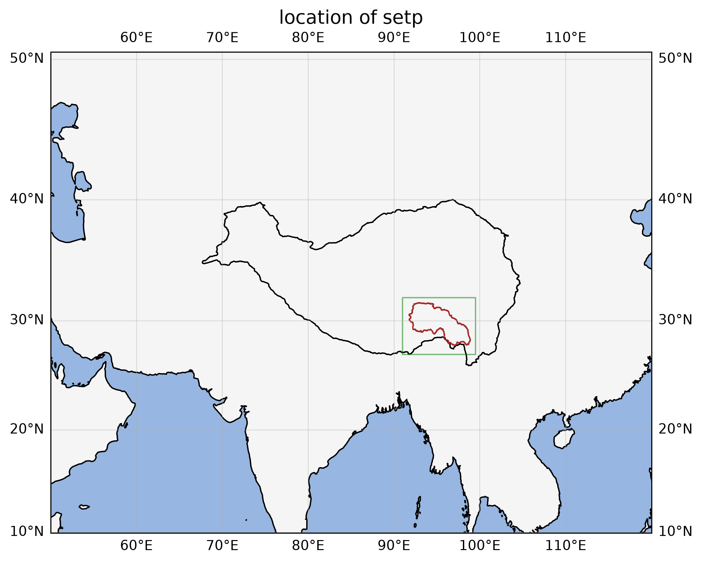
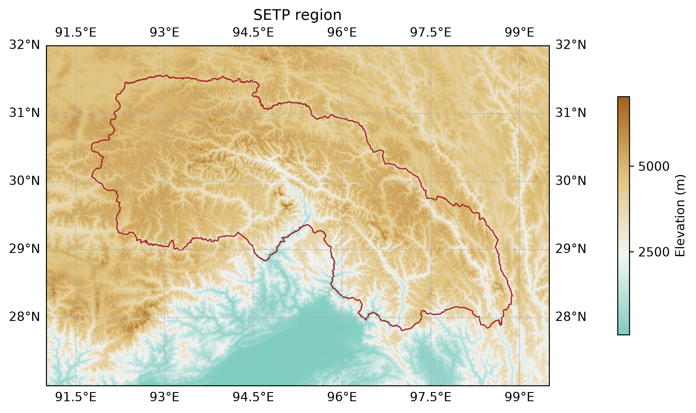

## SETP Crosphere

Crosphere study in Southeastern Tibetan Plateau (SETP).

## 1. Study area

  
  

### Reference:    
1. Zhang, Y.L., Li, B.Y., Liu, L.S., Zheng, D. (2021). Redetermine the region and boundaries of Tibetan Plateau. GEOGRAPHICAL RESEARCH, 40(6), 1543-1553.
2. Zhao, F.; Long, D.; Li, X.; Huang, Q.; Han, P. Rapid glacier mass loss in the Southeastern Tibetan Plateau since the year 2000 from
   satellite observations. Remote Sens. Environ. 2022, 270, 112853.

### 2. Study Contents:

1. glacier lake1.1 glacier lake extent (deeplearning)2.2 glacier lake level(icesat-2/swot/s3)
2. glacier2.1 glacier extent (deeplearning)2.2 glacier elevation (aster/kh)2.3 glacier surge
3. mass change

